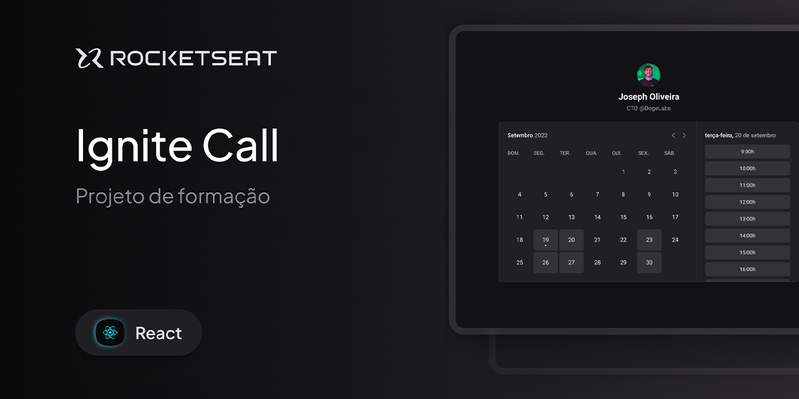

# Ignite Call

Agendamento descomplicado. Conecte seu calendário e permita que as pessoas marquem agendamentos no seu tempo livre.

<div align="center">
  <a href="https://ignite-call-gamma-liart.vercel.app/" target="_blank">
    
  </a>
</div>

## 📌 Sobre o Projeto

Ignite Call é uma aplicação web moderna que simplifica o processo de agendamento. Usuários podem conectar suas contas de calendário e compartilhar sua disponibilidade com outras pessoas, permitindo que elas marquem compromissos automaticamente em horários livres.

## 🌐 Demo

- **Aplicação**: [ignite-call-gamma-liart.vercel.app](https://ignite-call-gamma-liart.vercel.app/)
- **Repositório**: [github.com/Robson16/ignite-call](https://github.com/Robson16/ignite-call)

## 🛠️ Tecnologias

- **Framework**: [Next.js](https://nextjs.org/) 16.1.4
- **UI Library**: [React](https://react.dev/) 19.2.3
- **Styling**: [Styled Components](https://styled-components.com/) 6.3.8
- **Design System**: [@beryl-ui/react](https://www.npmjs.com/package/@beryl-ui/react) 2.2.1
- **Linguagem**: [TypeScript](https://www.typescriptlang.org/) 5
- **Ferramentas**:
  - ESLint 9 (linting)
  - Prettier 3.8.1 (formatação)

## 📋 Requisitos

- Node.js 18+
- npm ou yarn

## 🚀 Como Começar

### Instalação

```bash
# Clone o repositório
git clone https://github.com/Robson16/ignite-call.git
cd ignite-call

# Instale as dependências
npm install
```

### Desenvolvimento

```bash
# Inicie o servidor de desenvolvimento
npm run dev
```

Acesse [http://localhost:3000](http://localhost:3000) no seu navegador.

### Build para Produção

```bash
# Crie a build de produção
npm run build

# Inicie o servidor de produção
npm start
```

## 📝 Scripts Disponíveis

- `npm run dev` - Inicia o servidor de desenvolvimento
- `npm run build` - Cria a build de produção
- `npm start` - Inicia o servidor de produção
- `npm run lint` - Verifica problemas de linting
- `npm run lint:fix` - Corrige automaticamente problemas de linting
- `npm run format` - Formata o código com Prettier
- `npm run format:check` - Verifica se o código está formatado
- `npm run check-up` - Executa format e lint:fix

## 📁 Estrutura do Projeto

```
ignite-call/
├── public/              # Arquivos estáticos
├── src/
│   ├── app/            # Aplicação Next.js (App Router)
│   │   ├── layout.tsx  # Layout principal
│   │   ├── page.tsx    # Página inicial
│   │   ├── _components/
│   │   │   └── Hero/   # Componentes da página
│   │   └── _lib/
│   ├── _styles/        # Estilos globais
│   └── ...
├── package.json
├── tsconfig.json
├── eslint.config.mjs
├── next.config.ts
└── README.md
```

## 🎨 Recursos Principais

- ✅ Agendamento simplificado
- ✅ Integração com calendários
- ✅ Interface responsiva e moderna
- ✅ Desenvolvido com tecnologias modernas

## 🎯 Layout

O design da aplicação foi criado no Figma e pode ser visualizado no arquivo da comunidade:

- **[Ignite Call - Layout no Figma](https://www.figma.com/community/file/1161274296921389678)**

O layout define a estrutura visual e a experiência do usuário, servindo como referência para desenvolvimento dos componentes da aplicação.

## 📄 Licença

Este projeto está licenciado sob a [MIT License](LICENSE).

## 👤 Autor

**Robson** - [GitHub](https://github.com/Robson16)
